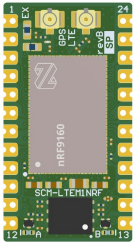
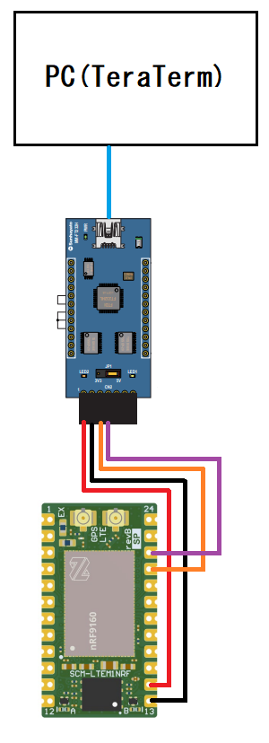
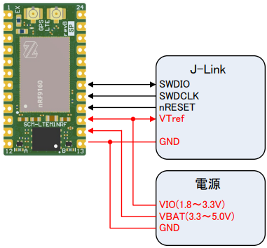

# 概要

セキュアモバイルコネクトの実用性を確認するため、  
さくらのモノプラットフォームで無料提供されている[DIP型LTEモジュール基板(SCM-LTEM1NRF)](https://iot.sakura.ad.jp/request_platform_devkit/)でセキュアモバイルコネクトを使用する.  

  

# 1. SIMを使えるようにする.

アカウントの作成、モバイルゲートウェイ/SIMの作成/設定、その他諸々のSIMが使用可能となるまでの手順は[公式ドキュメント](https://manual.sakura.ad.jp/cloud/manual-mobile-connect.html)を参照.  

# 2. 配線する

UARTで通信するので,  
手元にあったMM-FT232H(サンハヤト)を使って下記の配線する.  
~~最初3.3V設定で試したが、動かなかったので5V設定で動作させた.~~  
手前の環境では3.3V設定でないとUARTの送信が成功しなかったので3.3V設定とした.  
最初3.3V設定で動作しなかった理由はVIOに3.3V給電していない状態で基板のLEDの点灯を行った為と考えられる.  
VIOに3.3V給電した結果、問題無く動作させることが出来た.  

|項目           |環境           |備考   |
|---            |---            |---    |
|UI             |Tera Term      |       |
|シリアル通信   |MM-FT232H      |       |
|SIMモジュール  |SCM-LTEM1NRF   |       |

  

# 3. 動作確認

ここまでで1度動作確認する.  
出荷時にソフトが書込まれているのでTera Termを下記の設定で起動し、  
通電すれば起動することを確認できる.  
が、```Set AuthMode to `SIM Auth' faild...(Retry after 10s)```が出力され続けて```+++ Ready +++```が表示されない.  
```+++ Ready +++```が表示されないとコマンドも受け付けない仕様らしいので、
現状これ以上は確認できない.  
セキュアモバイルコネクトではなくモノプラットフォーム環境を構築していればSIM認証に成功してコマンド入力を受け付けると思われる.  

|項目           |方式                           |備考   |
|---            |---                            |---    |
|ボーレート     |標準115200bps                  |       |
|データビット   |8bit                           |       |
|スタートビット |1bit                           |       |
|ストップビット |1bit                           |       |
|パリティ       |なし                           |       |
|改行コード     |送受共にCR+LF                  |       |
|フロー制御     |なし                           |       |
|文字間必要遅延 |0ms                            |       |
|行間必要遅延   |前コマンド行レスポンス完了後0ms|       |

# 4. ソフトウェアの書き換えを行う

上記の理由によりソフトウェアを書換える必要があるが、
いざ取り組んでみるといくつか注意点があった.  

* 注意1 [公式ドキュメント](https://manual.sakura.ad.jp/cloud/iotpf/latest-pcb-files.html)からリンクされている[サンプルコード](https://github.com/sakura-internet/sipf-std-client_nrf9160)はNordicのSDK(v1.7.1)が古すぎてビルドできない.(2023.05.26時点)  
  最新SDK対応のプロジェクトはGitHubを漁らないと見つけられない.  

* 注意2 VSコード向け拡張機能からアプリを作成しようとするとテンプレートやビルドのターゲット基板選択時にどれを選んでいいのが分からない.(どれでもそれなりには動くとは思うけど)  
  とりあえず動かすレベルの現段階では[サンプルコード]([下記](https://github.com/sakura-internet/sipf-lib_sample_app_tx_nrf9160))を使うのが無難だと判断した.  

## 実際に行った手順

上記**注意**を踏まえた上で以降の手順で書換えを行った.  
※各ソフトウェアのバージョンはその都度そろえること.  
※**nRF Connect for Desktop**の使い方に関しては[ハードウェア仕様書](https://manual.sakura.ad.jp/cloud/_downloads/%E3%83%8F%E3%83%BC%E3%83%89%E3%82%A6%E3%82%A7%E3%82%A2%E4%BB%95%E6%A7%98%E6%9B%B8_DIP%E5%9E%8BLTE%E3%83%A2%E3%82%B8%E3%83%A5%E3%83%BC%E3%83%AB%E5%9F%BA%E6%9D%BF_SCM-LTEM1NRF.pdf)を参考にすること.  

1. [**nRF Connect for Desktop**](https://www.nordicsemi.com/Software-and-tools/Development-Tools/nRF-Connect-for-desktop/Download)をインストール.  
2. **nRF Connect for Desktop**のToolchain Managerから最新のSDK(v2.3.0)をインストール.  
3. Git Hubから[SDK v2.3系対応のライブラリ](https://github.com/sakura-internet/sipf-lib_nrfconnect)をクローン.  
4. Git Hubから[サンプルアプリ](https://github.com/sakura-internet/sipf-lib_sample_app_tx_nrf9160)をクローン.  
5. クローンした[サンプルアプリ](https://github.com/sakura-internet/sipf-lib_sample_app_tx_nrf9160)のlib > sipfにクローンした[SDK v2.3系対応のライブラリ](https://github.com/sakura-internet/sipf-lib_nrfconnect)を格納.  
6. [サンプルアプリ](https://github.com/sakura-internet/sipf-lib_sample_app_tx_nrf9160)をVS CODEで開く.  
7. VS CODEの拡張機能**NRF CONNECT**をインストールし、プロジェクトをビルドする.  
8. [ハードウェア仕様書](https://manual.sakura.ad.jp/cloud/_downloads/%E3%83%8F%E3%83%BC%E3%83%89%E3%82%A6%E3%82%A7%E3%82%A2%E4%BB%95%E6%A7%98%E6%9B%B8_DIP%E5%9E%8BLTE%E3%83%A2%E3%82%B8%E3%83%A5%E3%83%BC%E3%83%AB%E5%9F%BA%E6%9D%BF_SCM-LTEM1NRF.pdf)に従って配線する.  
     
9. **nRF Connect for Desktop**のProgrammerから[サンプルアプリ](https://github.com/sakura-internet/sipf-lib_sample_app_tx_nrf9160)のbuild > zephyr > merged.hexを書込む.  
10. [nRF9160DKの最新ファームウェア](https://www.nordicsemi.com/Products/Development-hardware/nRF9160-DK/Download#infotabs)(例 : mfw_nrf9160_1.3.4.zip)をダウンロードする.  
11. **nRF Connect for Desktop**のProgrammerから[nRF9160DKの最新ファームウェア](https://www.nordicsemi.com/Products/Development-hardware/nRF9160-DK/Download#infotabs)を書込む.  

以上よりファームウェアを書き換えることができる.  

# 5. コーディング

TBD
